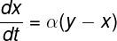
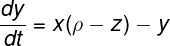
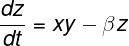

<!--
    The README template used is othneildre/Best-README-Template
    All template credits are owned by the template creator
    Also check out the template page
    https://github.com/othneildrew/Best-README-Template
-->

<div id="top"></div>

<!-- PROJECT LOGO -->
<br />
<div align="center">
  <a href="https://github.com/JoaoMario109/lorenz-attractor">
    
  </a>

  <h3 align="center">Lorenz Attractor Simulation</h3>

  <p align="center">
    Lorenz Attractor simulation in C++ with OpenGL.
    <br />
    <br />
    <a href="https://github.com/JoaoMario109/lorenz-attractor/issues">Report Bug</a>
    ·
    <a href="https://github.com/JoaoMario109/lorenz-attractor/issues">Request Feature</a>
  </p>
</div>


<!-- TABLE OF CONTENTS -->
<details>
  <summary>Table of Contents</summary>
  <ol>
    <li>
      <a href="#about-the-project">About The Project</a>
      <ul>
        <li><a href="#built-with">Built With</a></li>
      </ul>
    </li>
    <li>
      <a href="#getting-started">Getting Started</a>
      <ul>
        <li><a href="#prerequisites">Prerequisites</a></li>
        <li><a href="#installation">Installation</a></li>
      </ul>
    </li>
    <li><a href="#usage">Usage</a></li>
    <li><a href="#contributing">Contributing</a></li>
    <li><a href="#license">License</a></li>
    <li><a href="#contact">Contact</a></li>
  </ol>
</details>

<!-- ABOUT THE PROJECT -->
<div id="about-the-project"></div>

## About The Project

The software is an implementation of the lorenz system simulation using C++ and OpenGL 4.5 using volume rendering technique to visualize the output data for the solution of the set of differential equations.

In general the system is a simplified model of atmospheric convection developed by Edward Lorenz with the help of Ellen Fetter and Margaret Hamilton, this model is a set of 3 ODEs (Ordinary Differential Equations) known as the Lorenz Equations

The model:
<div align="center"></div>
<div align="center"></div>
<div align="center"></div>

The model is concerned with the properties of a two-dimensional layer of fluid being heated uniformly from below while being cooled uniformly from above.

<!-- BUILT WITH -->
<div id="built-with"></div>

### Built With
* [OpenGL](https://www.opengl.org/)
* [GLFW](https://www.glfw.org/)
* [GLAD](https://glad.dav1d.de/)
* [GLM](https://github.com/g-truc/glm)
* [imgui](https://github.com/ocornut/imgui)
* [CMake](https://cmake.org/)

<p align="right">(<a href="#top">back to top</a>)</p>

<hr />

<!-- GETTING STARTED -->
<div id="getting-started"></div>

## Getting Started

<!-- PREREQUISITES -->
<div id="prerequisites"></div>

### Prerequisites

* The project uses [CMake](https://cmake.org/) for its build, so make sure you have it installed and working properly on your machine.
* This project uses OpenGL API 4.5, so make sure your video card supports this version.
* If you are using a windows machine, I recommend to have installed VisualStudio to facilitate the build.

<!-- INSTALLATION -->
<div id="installation"></div>

### Installation


1. Clone the repository recursively.
   ```sh
   git clone https://github.com/JoaoMario109/lorenz-attractor.git --recursive
   ```
2. Create a **build** directory after change to the new created **build** directory and generate the project build files.
   ```sh
   mkdir build
   cd build
   cmake ..
   ```
3. Build the project
    3.1. In linux use make to build
    ```sh
    make
    ```
    3.2. In windows just open the .sln file generated with VisualStudio and after that build the project.

<p align="right">(<a href="#top">back to top</a>)</p>

<hr />

<!-- USAGE -->
<div id="usage"></div>

## Usage

To launch the software just execute the generated executable in the **build** directory.

<p align="right">(<a href="#top">back to top</a>)</p>

<hr />

<!-- CONTRIBUTING -->
<div id="contributing"></div>

## Contributing

All contributions are welcome to the project.

<p>
When contributing to the project, make sure to ident your code using tabs with size 4, also make sure to take a better look in the conventions used in the code and try to follow it, this helps keep the code uniform, easy to understand.
</p>

Also remember the branch structures of the project
* ***master*** -> This branch only contains releases that are approved to deployment
* ***develop*** -> This branch only contains complete implemented and working features, all code submitted to these branch should compile without any compiler error.
* ***{developer-short-name}/{feature-description}*** -> Any code in development or feature improvement.

1. Get the last develop and use as base for your branch
2. Create your branch (`git checkout -b {developer-short-name}/{feature-description}`)
3. Make your changes to the code
4. Add only needed changes to staged
5. Commit your changes with good titled and description messages (`git commit`)
6. Push to the branch (`git push origin {developer-short-name}/{feature-description}`)
7. Open a PullRequest to develop
8. Await reveal and approval to rebase and merge

<p align="right">(<a href="#top">back to top</a>)</p>

<hr />

<!-- LICENSE -->
<div id="license"></div>

## License

Distributed under the MIT License. See `LICENSE.txt` for more information.

<p align="right">(<a href="#top">back to top</a>)</p>

<hr />

<!-- CONTACT -->
<div id="contact"></div>

## Contact

João Mário Carnieletto Izoton Lago - [Joao Mario](https://www.linkedin.com/in/jo%C3%A3o-m%C3%A1rio-lago-a69b2b215/)

Project Link: [https://github.com/JoaoMario109/lorenz-attractor](https://github.com/JoaoMario109/lorenz-attractor)

<p align="right">(<a href="#top">back to top</a>)</p>